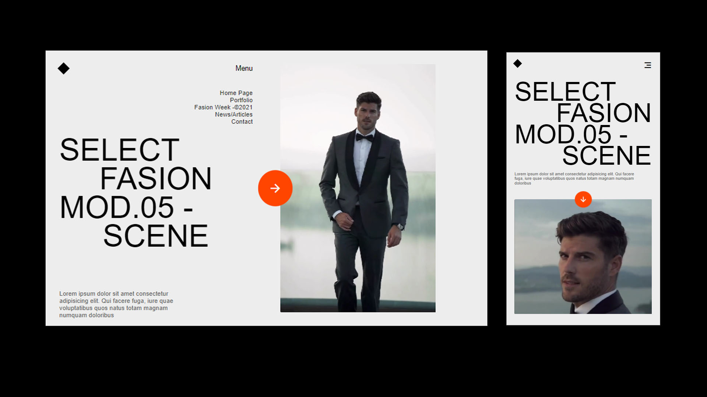

# Project Title

## Description

Describe your project briefly. What does it do? What technologies did you use?

## Features

- List the key features of your project.

## Screenshots

Include screenshots or images showcasing your project. 

## Getting Started

### Prerequisites

List any prerequisites or requirements needed to run the project.

### Installation

Provide step-by-step instructions on how to install and set up your project.

## Usage

Provide examples or instructions on how to use your project.

## Built With

- HTML
- CSS
- [Remixicon](https://remixicon.com/) - For icons

## Acknowledgements

Give credit to any resources, tutorials, or tools that you used or were inspired by.

## Contributors

List the contributors to your project.

## License

This project is licensed under the [MIT License](LICENSE) - see the [LICENSE](LICENSE) file for details.

